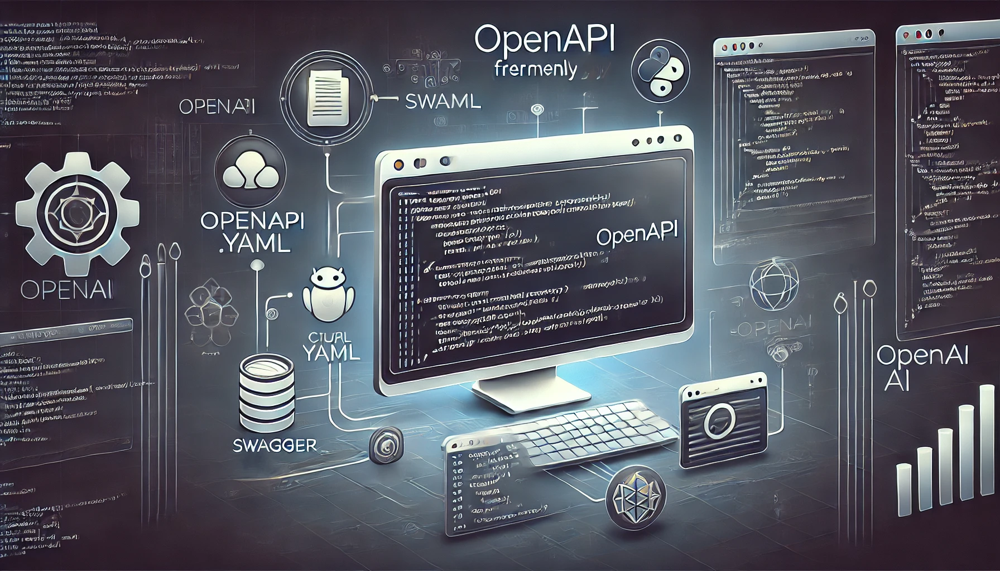
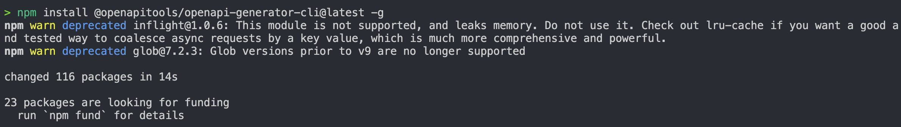
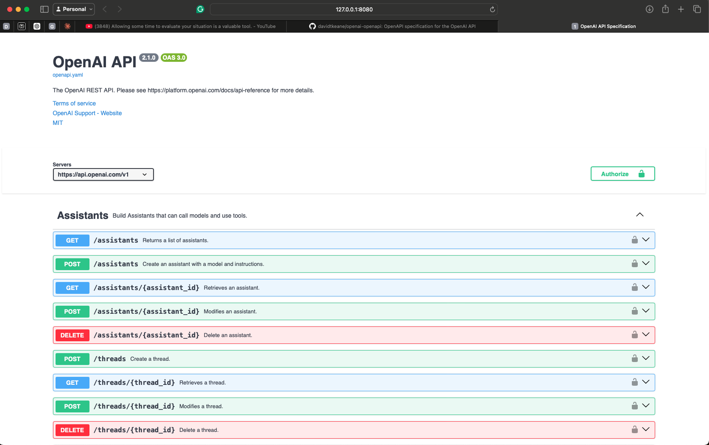
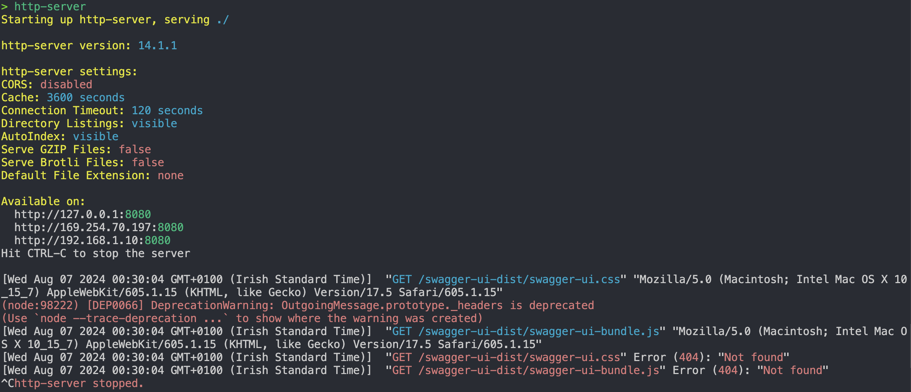
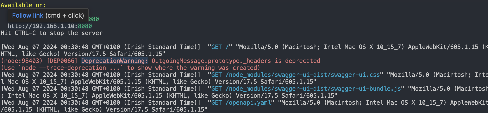

# OpenAPI Specifications for the OpenAI API

<div align="center">
  <a href="https://github.com/openai/openai-openapi">
    
	
  </a>

  <a href="https://github.com/openai/openai-openapi/issues">
    
  </a>
  <a href="https://github.com/openai/openai-openapi/pulls">
    
  </a>
  <a href="https://github.com/openai/openai-openapi/discussions">
    
  </a>
  <br>
  <a href="https://github.com/openai/openai-openapi/stargazers">
    
  </a>
  <a href="https://github.com/openai/openai-openapi/network/members">
    
  </a>
</div>
<br>

This repository contains an [OpenAPI](https://www.openapis.org/) specification for the [OpenAI API](https://platform.openai.com/docs/api-reference).

<p align="center">
  
</p>

## Table of Contents

1. [Introduction](#introduction)
2. [Prerequisites](#prerequisites)
3. [Installation](#installation)
4. [How to use the YAML file](#How)
5. [API Endpoints](#api-endpoints)
6. [Authentication](#authentication)
7. [Examples](#examples)
8. [Troubleshooting](#troubleshooting)
9. [Contributing](#contributing)
10. [License](#license)
11. [Acknowledgements](#acknowledgements)

## Introduction

This repository contains the OpenAPI (formerly Swagger) specification for the OpenAI API. It provides a comprehensive description of the available endpoints, request/response structures, and authentication methods for interacting with OpenAI's powerful language models and tools.

1. These instructions will get you to view the openapi.yaml file in a browser.
2. There are examples of using OpenAI's code to do things, like chat to an ai and ask for a picture.
3. CURL and PYTHON code is used for the examples.
4. 10 minutes to install and get up and running with the openapi.yaml file in a browser.
5. More time needed to play with the examples.
6. The openapi.yaml file is a YAML file that contains the OpenAPI specification for the OpenAI API.
7. Not too much experience is needed to use the openapi.yaml file, just follow the instructions below and use ChatGPT to help you with any issues.

### OpenAI Services Covered

- **Chat Completions**: Generate human-like text responses based on prompts.
- **Audio Transcription and Translation**: Convert audio files into text or translate them into different languages.
- **Image Generation and Editing**: Create or modify images using text prompts.
- **Embeddings**: Convert text into numerical vectors for machine learning models.
- **Fine-tuning**: Customize pre-trained models for specific tasks.
- **File Management**: Upload, manage, and retrieve files used for training and other purposes.
- **Moderation**: Check text for content that violates OpenAI's usage policies.
- **Assistants API (beta)**: Create AI assistants to help with various tasks.

## Prerequisites

<p align="center">
  
</p>

1. **Download VSCode**: A wonderful program for running Python files. [Download VSCode](https://code.visualstudio.com/)
2. **Install Required VSCode Plugins**: Learn how to install the necessary plugins for this project. [VSCode Plugins Guide](https://code.visualstudio.com/docs/editor/extension-marketplace)
3. **Introduction to Python**: Learn what Python is, how to install it, and the top commands to use it. [Python Installation Guide](https://www.python.org/downloads/)
4. **Understanding HTML**: What is HTML and its role in web development. [HTML Introduction](https://developer.mozilla.org/en-US/docs/Web/HTML)
5. **Using HTTP-SERVER**: Learn how to use HTTP-SERVER and its functionalities. [HTTP-SERVER Guide](https://www.npmjs.com/package/http-server)
6. **YAML File**: What is a YAML file, its uses, and functionalities. [YAML Introduction](https://yaml.org/)
7. **An OpenAI API key**: Sign up at [OpenAI Platform](https://platform.openai.com/) to get your API key.
8. **Basic understanding of RESTful APIs and JSON**:
   - **RESTful APIs**: A style of web service that uses HTTP methods (GET, POST, PUT, DELETE) to interact with resources. Learn more at [RESTful API Introduction](https://restfulapi.net/).
   - **JSON**: A lightweight data-interchange format. Learn more at [JSON Introduction](https://www.json.org/).
9. **A text editor or IDE**: Such as Visual Studio Code (VSCode), Sublime Text, or Atom. [VSCode](https://code.visualstudio.com/), [Sublime Text](https://www.sublimetext.com/), [Atom](https://atom.io/)
10. **(Optional) Postman, curl, or any API testing tool**:
    - **Postman**: An API platform for building and using APIs. Learn more at [Postman](https://www.postman.com/).
    - **curl**: A command-line tool for transferring data with URLs. Learn more at [curl](https://curl.se/).
    - **API testing tools**: Tools like Insomnia, Paw, or RESTClient. [Insomnia](https://insomnia.rest/), [Paw](https://paw.cloud/), [RESTClient](https://addons.mozilla.org/en-US/firefox/addon/restclient/)

## Installation

<p align="center">
  
</p>

This repository contains an OpenAPI specification file, which doesn't require installation in the traditional sense. However, to make the most of it, you may want to set up some tools:

1. **Clone this repository**:

   ```bash
   git clone https://github.com/openai/openai-openapi.git
   ```
2. **Install Swagger UI (optional, for visual exploration)**:

   - **Swagger UI**: A tool to visualize and interact with the API’s resources. Learn more at [Swagger UI](https://swagger.io/tools/swagger-ui/).
   - **npm**: A package manager for JavaScript. Learn more at [npm](https://www.npmjs.com/).
   - Install these two packages one at a time

   ```bash
   npm install -g http-server
   npm install swagger-ui-dist
   npm update
   ```

### Additional Tips

Check for Updates Regularly: Regularly check for updates to your dependencies to ensure you are using the latest versions and avoid deprecated modules.

```bash
npm audit 
npm audit fix
```

By following these steps, you should be able to address the deprecation warnings and ensure that your project uses up-to-date and supported dependencies.

3. **Install an OpenAPI generator (optional, for client library generation)**:

   - **OpenAPI Generator**: A tool to generate API client libraries, server stubs, documentation, and configuration. Learn more at [OpenAPI Generator](https://openapi-generator.tech/).

   ```bash
   npm install @openapitools/openapi-generator-cli -g
   ```

- You might get this error like I did, I continued with the instructions and I was able to get the .yaml file open in my browser.



## How to Use the .YAML File

<p align="center">
  
</p>

### Viewing the Specification

1. **Open the `openapi.yaml` file** in your text editor to explore the API structure.

   - **YAML file**: A human-friendly data serialization standard. Learn more at [YAML](https://yaml.org/).
   - **Text editor**: Such as VSCode, Sublime Text, or Atom.
2. **To view the specification in Swagger UI**:

   - Just check that the `swagger-ui-dist` folder to your node_modules folder or directory.
   - Create an `index.html` file with the following content:
   - Save the `index.html` file in the same folder as **the `openapi.yaml` file**.

     ```html
     <!DOCTYPE html>
     <html lang="en">
     <head>
       <meta charset="utf-8" />
       <meta name="viewport" content="width=device-width, initial-scale=1" />
       <title>OpenAI API Specification</title>
       <link rel="stylesheet" href="node_modules/swagger-ui-dist/swagger-ui.css" />
     </head>
     <body>
       <div id="swagger-ui"></div>
       <script src="node_modules/swagger-ui-dist/swagger-ui-bundle.js"></script>
       <script>
         window.onload = () => {
           window.ui = SwaggerUIBundle({
             url: "openapi.yaml",
             dom_id: "#swagger-ui",
           });
         };
       </script>
     </body>
     </html>
     ```
   - Run `http-server` in your project directory terminal.
   - Open a web browser and navigate to `http://localhost:8080`
   - You now should see this!
   - 
   - If you see this error below, reinstall the `npm install swagger-ui-dist` again, then make sure the swagger-ui-dist is inside the none_modules folder. Then run `http-server` again and navigate to `http://localhost:8080.`

     
   - When you reinstall and make sure the node_modules is in the correct place you should see this in the terminal.
   - 

### Generating Client Libraries

To generate client libraries for your preferred programming language:

- I didn't have to do this step, as I am only learning .yaml.

```bash
openapi-generator-cli generate -i openapi.yaml -g <language> -o ./client
```

Replace `<language>` with your desired language (e.g., `python`, `javascript`, `java`).

## API Endpoints

The specification covers the following main categories of endpoints:

- `/chat/completions`
- `/audio/transcriptions`
- `/audio/translations`
- `/images/generations`
- `/embeddings`
- `/fine-tuning/jobs`
- `/files`
- `/moderations`
- `/assistants` (beta)
- `/threads` (beta)

### Examples

<p align="center">
  
</p>

#### Chat Completions

Generate a response to a user message:

```bash
curl https://api.openai.com/v1/chat/completions \
  -H "Content-Type: application/json" \
  -H "Authorization: Bearer YOUR_API_KEY" \
  -d '{
    "model": "gpt-3.5-turbo",
    "messages": [{"role": "user", "content": "Hello, how are you?"}]
  }'
```

#### Audio Transcriptions

Transcribe an audio file:

```bash
curl https://api.openai.com/v1/audio/transcriptions \
  -H "Authorization: Bearer YOUR_API_KEY" \
  -F file=@path/to/audio/file \
  -F model="whisper-1"
```

#### Image Generation

Generate an image based on a text prompt:

```bash
curl https://api.openai.com/v1/images/generations \
  -H "Content-Type: application/json" \
  -H "Authorization: Bearer YOUR_API_KEY" \
  -d '{
    "prompt": "A cute baby sea otter",
    "n": 1,
    "size": "1024x1024"
  }'
```

## Authentication

All requests to the OpenAI API require authentication. You need to include your API key in the `Authorization` header:

```http
Authorization: Bearer YOUR_API_KEY
```

### Python Script Example

```python
import requests

url = "https://api.openai.com/v1/chat/completions"
headers = {
    "Content-Type": "application/json",
    "Authorization": "Bearer YOUR_API_KEY"
}
data = {
    "model": "gpt-3.5-turbo",
    "messages": [{"role": "user", "content": "Hello, how are you?"}]
}

response = requests.post(url, headers=headers, json=data)
print(response.json())
```

### curl Example

```bash
curl https://api.openai.com/v1/chat/completions \
  -H "Content-Type: application/json" \
  -H "Authorization: Bearer YOUR_API_KEY" \
  -d '{
    "model": "gpt-3.5-turbo",
    "messages": [{"role": "user", "content": "Hello, how are you?"}]
  }'
```

### Step-by-Step Guide to Run the Script

1. **Install Python**: Ensure Python is installed on your system. Download it from [Python.org](https://www.python.org/).
2. **Install Requests Library**: Run `pip install requests` in your terminal.
3. **Create a Python File**: Create a file named `openai_example.py` and paste the Python script above.
4. **Run the Script**: Open a terminal, navigate to the directory containing the script, and run `python openai_example.py`.

## Troubleshooting

Ensure your API key is valid and has the necessary permissions.
Check that you're using the correct endpoint URLs and request structures.
Verify that your requests include the required headers and parameters.
Consult the OpenAI documentation for specific error messages and their meanings.

## Contributing

Contributions to improve the OpenAPI specification are welcome. Please follow these steps:

1. Fork the repository
2. Create a new branch for your changes
3. Make your changes and commit them with clear, descriptive messages
4. Push your changes to your fork
5. Submit a pull request with a description of your changes

## License

This OpenAI API specification is provided under the MIT License. Please note that while the specification itself is open-source, use of the OpenAI API is subject to OpenAI's terms of service and pricing.

## Acknowledgements

Special thanks to the OpenAI team for developing and maintaining the powerful API that this specification documents. We also acknowledge the contributions of the open-source community in creating tools and libraries that facilitate the use of OpenAPI specifications.

Made with ❤️ by David
