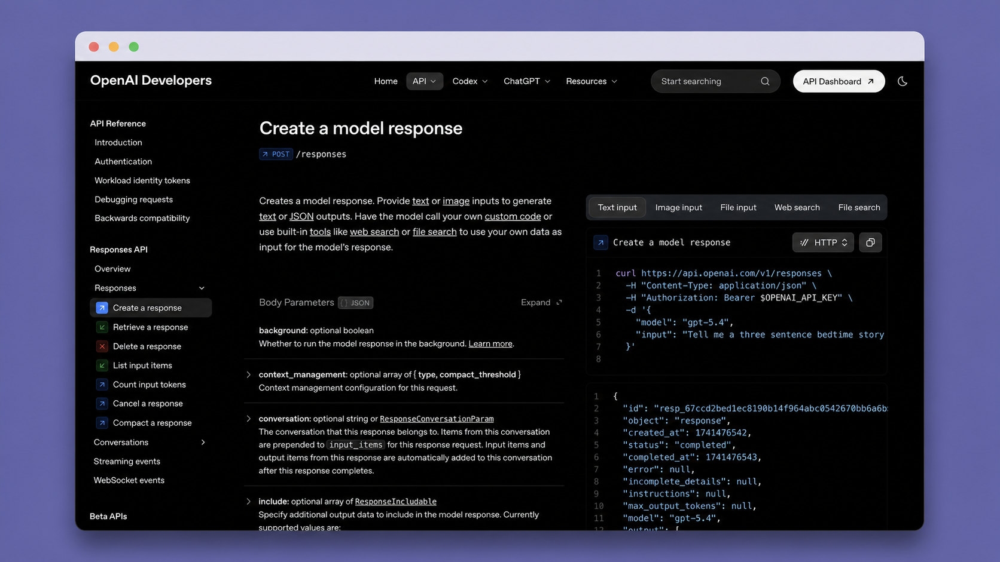

<div align="center">
  <h1>OpenAI API · OpenAPI specification</h1>

  <p>A machine-readable description of the OpenAI REST API, authored in OpenAPI 3.1.</p>

  <p>
    <a href="./openapi.yaml"><strong>Explore the spec</strong></a>
    ·
    <a href="https://developers.openai.com/api/reference/overview">API reference</a>
    ·
    <a href="https://help.openai.com/">Support</a>
  </p>

</div>

<p align="center">
  
</p>

## About

This repository publishes the OpenAPI specification for the OpenAI API. The spec describes the API's endpoints, authentication, parameters, and request and response schemas.

Use it to generate typed clients, build API explorers, configure testing tools, or work with the OpenAI API in any OpenAPI-compatible workflow.

> [!NOTE]
> Looking for human-readable documentation, guides, and examples? Visit the [OpenAI API docs](https://developers.openai.com/api/docs).

## Get the specification

Browse [`openapi.yaml`](./openapi.yaml) directly, or download the latest version:

```sh
curl -L https://raw.githubusercontent.com/openai/openai-openapi/master/openapi.yaml \
  -o openai-openapi.yaml
```

The document uses **OpenAPI 3.1** and can be imported into tools that support the OpenAPI ecosystem.

## Generated SDKs

OpenAI publishes the following official SDKs generated from this specification:

| Language or platform | Repository |
| --- | --- |
| Python | [`openai-python`](https://github.com/openai/openai-python) |
| JavaScript / TypeScript | [`openai-node`](https://github.com/openai/openai-node) |
| .NET | [`openai-dotnet`](https://github.com/openai/openai-dotnet) |
| Go | [`openai-go`](https://github.com/openai/openai-go) |
| Java | [`openai-java`](https://github.com/openai/openai-java) |
| Ruby | [`openai-ruby`](https://github.com/openai/openai-ruby) |

## Feedback

Found an incorrect schema, a missing field, or another problem with the specification? [Search the existing issues](https://github.com/openai/openai-openapi/issues) and, if it has not already been reported, [open a new issue](https://github.com/openai/openai-openapi/issues/new).

When reporting a problem, include the affected endpoint or schema and a minimal example when possible. The OpenAI team will make a best-effort attempt to triage and resolve spec issues.

For immediate help with the OpenAI API, [contact OpenAI Support](https://help.openai.com/en/articles/6614161-how-can-i-contact-support).

## License

This project is licensed under the [MIT License](./LICENSE).
