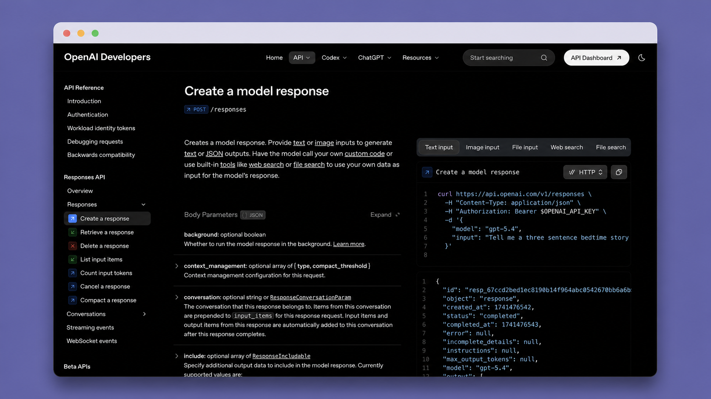

<div align="center">
  <h1>OpenAI API · OpenAPI specification</h1>

  <p>A machine-readable description of the OpenAI REST API, authored in OpenAPI 3.1.</p>

  <p>
    <a href="./openapi.yaml"><strong>Explore the spec</strong></a>
    ·
    <a href="https://developers.openai.com/api/reference/overview">API reference</a>
    ·
    <a href="https://help.openai.com/">Support</a>
  </p>

</div>

<p align="center">
  
</p>

## About

This repository publishes the OpenAPI specification for the OpenAI API. The spec describes the API's endpoints, authentication, parameters, and request and response schemas.

`openapi.yaml` and `openapi.json` are generated artifacts synchronized automatically from upstream source. See the [contribution policy](#contributing) and [feedback process](#feedback).

Use it to generate typed clients, build API explorers, configure testing tools, or work with the OpenAI API in any OpenAPI-compatible workflow.

> [!NOTE]
> Looking for human-readable documentation, guides, and examples? Visit the [OpenAI API docs](https://developers.openai.com/api/docs).

## Get the specification

Browse [`openapi.yaml`](./openapi.yaml) or [`openapi.json`](./openapi.json) directly, or download the latest YAML version:

```sh
curl -L https://raw.githubusercontent.com/openai/openai-openapi/main/openapi.yaml \
  -o openai-openapi.yaml
```

The document uses **OpenAPI 3.1** and can be imported into tools that support the OpenAPI ecosystem.

## Generated SDKs

OpenAI publishes the following official SDKs generated from this specification:

| Language or platform | Repository |
| --- | --- |
| Python | [`openai-python`](https://github.com/openai/openai-python) |
| JavaScript / TypeScript | [`openai-node`](https://github.com/openai/openai-node) |
| .NET | [`openai-dotnet`](https://github.com/openai/openai-dotnet) |
| Go | [`openai-go`](https://github.com/openai/openai-go) |
| Java | [`openai-java`](https://github.com/openai/openai-java) |
| Ruby | [`openai-ruby`](https://github.com/openai/openai-ruby) |

## Contributing

**This repository does not accept contributions.** Please do not submit pull requests for the specification, documentation, or assets. See [CONTRIBUTING.md](CONTRIBUTING.md) for the full policy.

OpenAI maintainers make specification corrections in the upstream source using the [internal OpenAPI authoring guide](https://github.com/openai/openai/blob/master/lib/js/oai_js_apidocs_data/src/openapi/README.md). The publication workflow updates this repository's generated YAML and JSON automatically; direct edits here do not update that source.

## Feedback

Found an incorrect schema, a missing field, or another problem with the specification? [Search the existing issues](https://github.com/openai/openai-openapi/issues) and, if it has not already been reported, [open a new issue](https://github.com/openai/openai-openapi/issues/new).

When reporting a non-security problem, include the affected revision, endpoint and HTTP method or schema, the expected behavior, and a minimal example using synthetic data. Remove credentials, customer data, and private URLs from examples and diagnostic output. The OpenAI team will make a best-effort attempt to triage and resolve spec issues.

**Report suspected vulnerabilities privately using [SECURITY.md](SECURITY.md), not in public issues or pull requests.**

For immediate help with the OpenAI API, [contact OpenAI Support](https://help.openai.com/en/articles/6614161-how-can-i-contact-support).

## License

This project is licensed under the [MIT License](./LICENSE).
